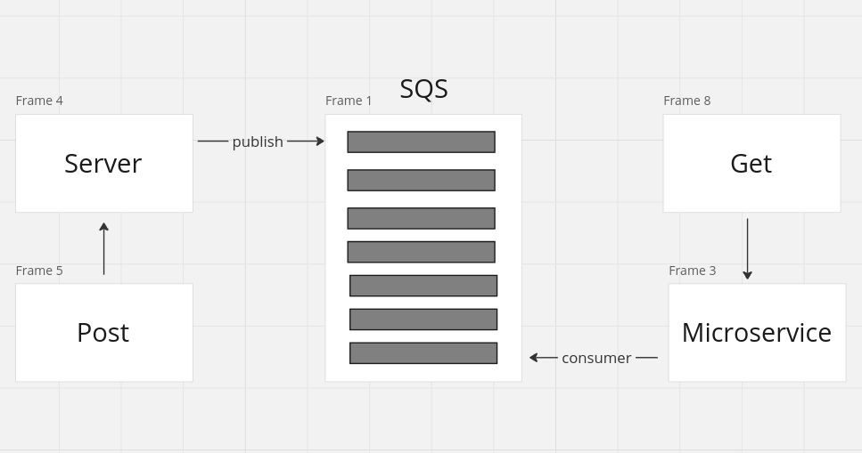

# AWS SQS

[SQS Res do micreservice](respose.json)

# Como Executar o Projeto

- criar uma fila SQS é adicionar a url na variavel de ambiente `SQS_URL`
- cd server && npm run start
- cd microservice && npm run start
